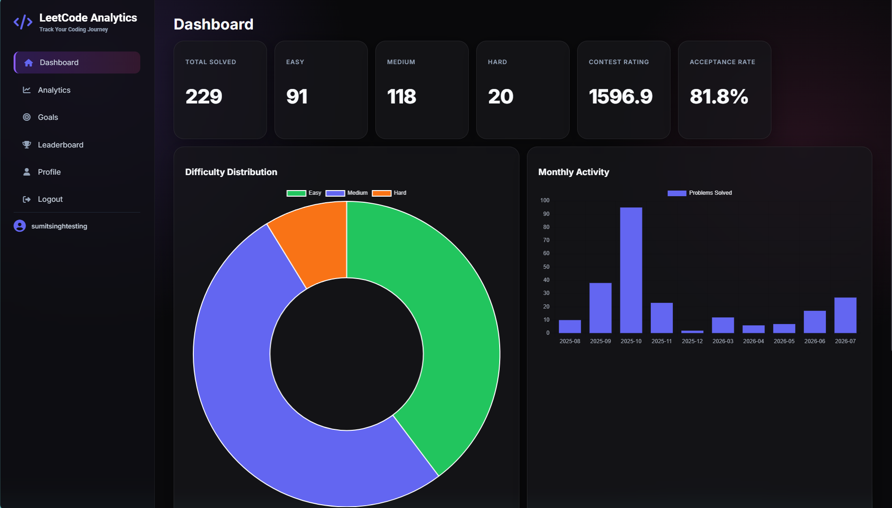
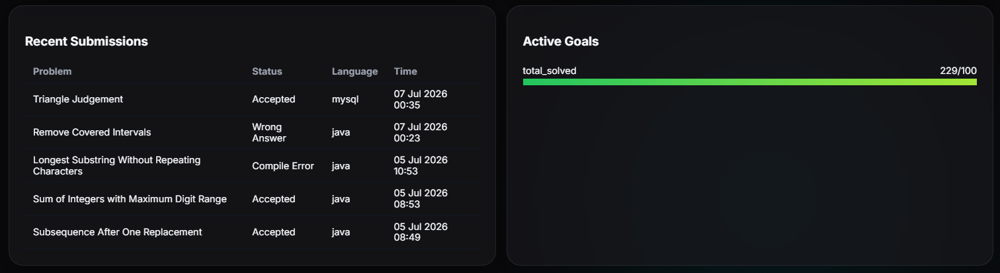

# 🚀 LeetCode Analytics Dashboard

A modern full-stack web application that helps users track, analyze, and visualize their LeetCode progress through an interactive dashboard.

---

## 📸 Preview

<p align="center">
    
    
</p>

---

## ✨ Features

- 🔐 Secure user authentication (Login & Registration)
- 📊 Interactive dashboard with coding statistics
- 📈 Monthly activity visualization using Chart.js
- 🍩 Difficulty distribution chart
- 🎯 Goal tracking system
- 🏆 Leaderboard
- 👤 User profile management
- 📱 Responsive interface
- 🌙 Modern dark-themed UI

---

## 🛠️ Tech Stack

### Backend
- Python
- Flask
- SQLAlchemy
- Flask-Login
- SQLite

### Frontend
- HTML5
- CSS3
- JavaScript
- Chart.js

### Tools
- Git
- GitHub

---

## 📂 Project Structure

```text
leetcode-analytics-dashboard/
│
├── app/
│   ├── models/
│   ├── routes/
│   ├── services/
│   ├── templates/
│   └── static/
│
├── database/
├── tests/
├── requirements.txt
├── run.py
└── README.md
```

---

## 🚀 Installation

Clone the repository

```bash
git clone https://github.com/sumitsinghbhutyal/leetcode-analytics-dashboard.git
```

Move into the project

```bash
cd leetcode-analytics-dashboard
```

Create a virtual environment

```bash
python -m venv venv
```

Activate it

Windows

```bash
venv\Scripts\activate
```

Linux / macOS

```bash
source venv/bin/activate
```

Install dependencies

```bash
pip install -r requirements.txt
```

Run the application

```bash
python run.py
```

---

## 📊 Future Improvements

- 🔥 GitHub-style contribution heatmap
- 🤖 AI-powered coding insights
- 📅 Daily coding streak tracker
- 🏅 Achievement badges
- 📈 Contest rating history
- 📚 Topic-wise progress analytics
- 🌐 Live deployment

---

## 📄 License

This project is developed for educational and portfolio purposes.
